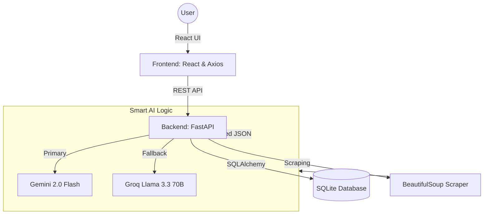

# 🍳 Recipe AI: Your Intelligent Kitchen Companion

Welcome to **Recipe AI**! I built this because I know that the hardest part of cooking isn't the stove—it's the planning, the messy handwritten lists, and the "what should we eat tonight?" fatigue. 

This app is designed to be your digital sous-chef, taking the stress out of your kitchen so you can focus on the joy of cooking.

## ✨ Why You'll Love This

- **Magical Extraction**: Tired of scrolling through life stories just to find a recipe? Paste any link, and I'll pull out just the good stuff—clean steps and clear ingredients.
- **Stress-Free Shopping**: I don't just give you a list; I organize it. Your ingredients are automatically sorted into grocery aisles so you can zip through the store.
- **The "Infinite" Meal Plan**: My AI looks at your favorite recipes and curates a 7-day menu that's actually diverse. No more eating the same leftovers for three days straight!
- **Built to Last**: I use a smart dual-brain system (Gemini + Groq). If one AI gets tired, the other kicks in automatically to finish your plan.
- **A Warm Hug for Your Eyes**: I've designed the UI with soft, warm tones to make your digital kitchen feel as cozy as your real one.

---

## 📸 See it in Action

### 1. Smart Extraction
Extract recipes from any URL instantly with AI-categorized shopping lists.


### 2. Your Recipe Library
A beautiful, organized home for all your culinary discoveries.


### 3. Dynamic Meal Planning
AI-curated weekly schedules that ensure variety and balance.


---

## 🏗 System Architecture

I've built Recipe AI with a modern, decoupled architecture to ensure speed and reliability.



### Technical Highlights:
- **Dual-AI Intelligence**: The system uses a primary/fallback model. It defaults to Gemini for ultra-fast processing and switches to Groq (Llama 70B) if quota limits are reached.
- **FastAPI Core**: Highly performant backend that handles recipe scraping and enrichment in parallel.
- **Responsive React**: A single-page application (SPA) focused on clean, warm aesthetics and seamless transitions.

---

## 🚀 Getting Started

I've kept things simple so you can get cooking fast.

### 1. Wake up the Backend
1. Head into the `backend` folder.
2. Set up your Python space:
   ```bash
   python -m venv venv
   source venv/Scripts/activate  # On Windows
   ```
3. Give it the tools it needs:
   ```bash
   pip install fastapi uvicorn sqlalchemy requests beautifulsoup4 google-genai python-dotenv
   ```
4. Add your "Secret Sauce" (API Keys):
   Create a `.env` file in `backend/` and drop in your keys:
   ```env
   GEMINI_API_KEY=your_key_here
   GROQ_API_KEY=your_key_here
   ```
5. Fire it up: `uvicorn app.main:app --reload`

### 2. Launch the Kitchen UI
1. Pop over to `frontend/frontend`.
2. Grab the dependencies: `npm install`
3. Open the doors: `npm start`

---

## ❤️ Feedback
I'm always looking to make Recipe AI better. If you have an idea for a feature or find a bug, let me know. Happy cooking!
